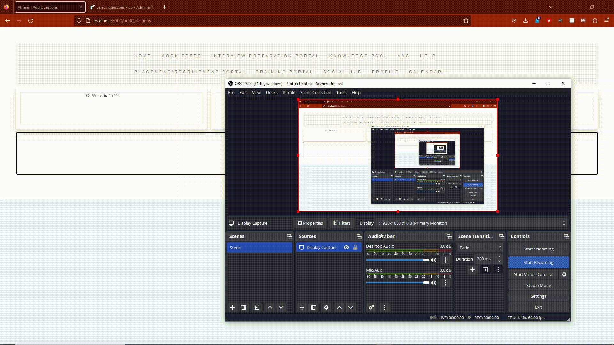

<h1 align="center">
  <br>
  <br>
  Support Portal
  <br>
</h1>

<h4 align="center">A minimal web application built on <a href="http://electron.atom.io" target="_blank">Docker</a> and <a href="">Node.js</a>.</h4>

<p align="center">
  <a href="https://badge.fury.io/js/electron-markdownify">
    
  </a>

<p align="center">
  <a href="#key-features">Key Features</a> •
  <a href="#how-to-use">How To Use</a> •
  <a href="#credits">Credits</a> •
  <a href="#license">License</a>
</p>



## Key Features

* Core setup of web application
* Cross platform
  - Windows, macOS and Linux ready.

## How To Use

To clone and run this application, you'll need [Git](https://git-scm.com), [Docker](https://www.docker.com/) and [docker-compose](https://docs.docker.com/compose/) installed on your computer. From your command line:

```bash
# Clone this repository
$ git clone <url>

# Go into the repository
$ cd consultant-portal

# Install dependencies and start 
$ docker-compose up

```

## Credits

This software uses the following open source packages:

- [Node.js](https://nodejs.org/)
- [Docker](https://www.docker.com/)

## License

MIT

---

